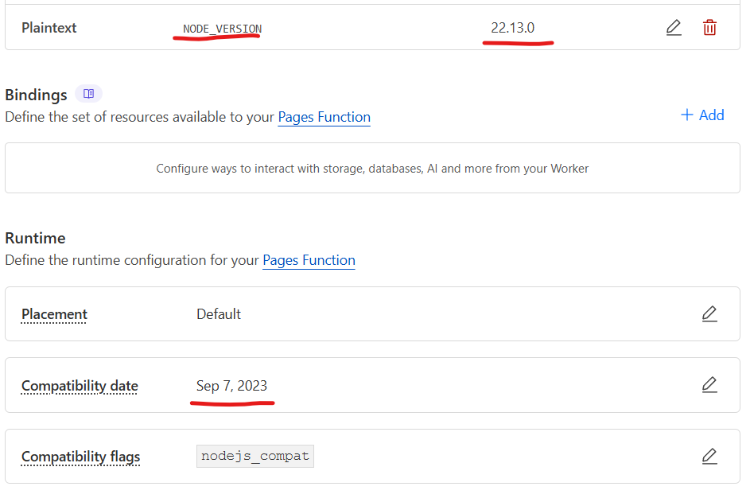

<h1 align="center">
  <br>
  <a href=# name="readme-top"></a>
</h1>

<h4 align="center"> Ubícate UC </h4>

<p align="center">
  <a href="#Descripción">Descripción</a> •
  <a href="#Uso">Uso</a> •
  <a href="#Contribuir">Contribuir</a> •
  <a href="#Créditos">Créditos</a> •
  <a href="#Soporte">Soporte</a> •
  <a href="#licencia">Licencia</a>
</p>

---

## Descripción

Proyecto Open Source desarrollado como un buscador de salas en los campus de la Pontificia Universidad Católica de Chile, que permite a los estudiantes encontrar y localizar rápidamente en un mapa dinámico.

Los datos iniciales del proyecto son sacados de [almapp/uc-maps-seeds](https://github.com/almapp/uc-maps-seeds)

<p align="right">(<a href="#readme-top">volver arriba</a>)</p>

## Query Params

Para centrar el mapa o la ubicación en el formulario en un campus específico, se puede agregar un parámetro en la URL con el nombre del campus:

```
https://ubicate.osuc.dev/map?campus={Nombre campus}
https://ubicate.osuc.dev/form-geo?campus={Nombre campus}
```

Donde `{Nombre campus}` puede ser:
- SanJoaquin
- CasaCentral
- Oriente
- LoContador
- Villarrica


Además se puede centrar el mapa en la ubicación de una sala dado su identificador

```
https://ubicate.osuc.dev/map?place={Id sala}
```

Donde `{Id sala}` puede ser:
- B12

## Developing

### Instalación

Agregar Api Key pública de Mapbox a variable de entorno en archivo ``.env.local``
Agregar la URL base del proyecto, actualmente es `https://ubicate.osuc.dev/`

```shell
NEXT_PUBLIC_MAPBOX_TOKEN = <API_KEY>
NEXT_PUBLIC_BASE_URL = <BASE_URL>
GITHUB_TOKEN_USER = <TOKEN_USER>
GITHUB_USER_EMAIL = <EMAIL>
GITHUB_BRANCH_NAME = <EXISTING_BRANCH>
```

### Instalar dependencias

```shell
npm install
```

### Ejecutar servidor de desarrollo

```shell
npm run dev
```

## Linter

Es necesario resolver los errores y warnings de linter en cada pull request, estos errores se muestran (y se resuelven la mayoría de errores) ejecutando:

```
npm run lint:fix
```

## Deployment

### Cloudflare (automatic)

Es necesario que el proyecto pueda realizar correctamente un `build` para poder ser desplegado en Cloudflare

```shell
npm run build:cloudflare
```

### Linux VM (manual)

1. Crear un usuario dedicado.

```
useradd ubicate
```

2. Clonar el repositorio.

```
git clone https://github.com/open-source-uc/UbiCate-v2 /usr/local/ubicate
```

3. Entrar al directorio

```
cd /usr/local/ubicate
```

4. [Agregar Environmental Variables](#instalación)

5. [Install npm dependencies](#instalar-dependencias)

6. [Ejecutar Linter](#linter)

7. Hacer una build.

```
npm run build
```

8. Crear la Systemd Unit

```
touch /etc/systemd/system/ubicate.service
```

```
[Unit]
Description=Ubicate
After=multi-user.target
After=network-online.target
Wants=network-online.target

[Service]
ExecStart=/usr/bin/npm --prefix /usr/local/ubicate run start
User=ubicate
Group=ubicate
Type=idle
Restart=on-abnormal
RestartSec=15
TimeoutStopSec=10

[Install]
WantedBy=multi-user.target
```

9. Reload Units

```
systemctl daemon-reload
```

10. Start y enable el servicio

```
systemctl enable --now ubicate.service
```

11. Reverse proxy con Apache

> Reemplazar `domain.tld` con su dominio.

```
<VirtualHost *:80>
    ServerAdmin webmaster@domain.tld
    ServerName ubicate.domain.tld
    ErrorLog "/var/log/httpd/ubicate.domain.tld-error_log"
    CustomLog "/var/log/httpd/ubicate.domain.tld-access_log" common


    <Location / >
        RequestHeader set X-SCRIPT-NAME /
        RequestHeader set X-SCHEME https
        ProxyPass http://localhost:3000/
        ProxyPassReverse http://localhost:3000/
        ProxyPassReverseCookiePath  /  /
    </Location>

</VirtualHost>
```

####


## Agregar nuevas salas

Las salas subidas en el formulario de la página se suben a una base de datos. Estas salas se tienen que añadir a `data/places.json`  para que sean agregadas a la página.

<p align="right">(<a href="#readme-top">volver arriba</a>)</p>

## Contribuir

### Bug Reports & Feature Requests

Utilice las **issues** para informar cualquier bug o solicitud.

### Workflow


> PR a development -> Revisar preview y checks -> Asignar reviewers -> Aprobación -> Merge a development

La información detallada sobre cómo contribuir se puede encontrar en [contributing.md](contributing.md).


## Necesitas contactarnos
Comuníquese con nosotros a traves de [osuc.dev](https://links.osuc.dev/)

<p align="right">(<a href="#readme-top">volver arriba</a>)</p>

## Créditos.


## Bugs

### Error del servidor 500
Si este error ocurre en Cloudflare, es muy probable que se deba a uno de los siguientes motivos:

Versión incorrecta de Node.js: Asegúrate de que la versión de Node.js configurada sea compatible con tu aplicación.

Fecha de compatibilidad obsoleta (Compatibility Date): Una fecha de compatibilidad muy antigua puede causar problemas con el entorno de ejecución de Cloudflare.




### Mantenedores

- [MrBased](https://github.com/MrBased)
- [mc-cari](https://github.com/mc-cari)
- [ooscarr](https://github.com/ooscarr)
- [vlermandac](https://github.com/vlermandac)
- [dvictorerol](https://github.com/dvictorerol)

<p align="right">(<a href="#readme-top">volver arriba</a>)</p>
## Licencia

[](./license.md)

<p align="right">(<a href="#readme-top">volver arriba</a>)</p>
